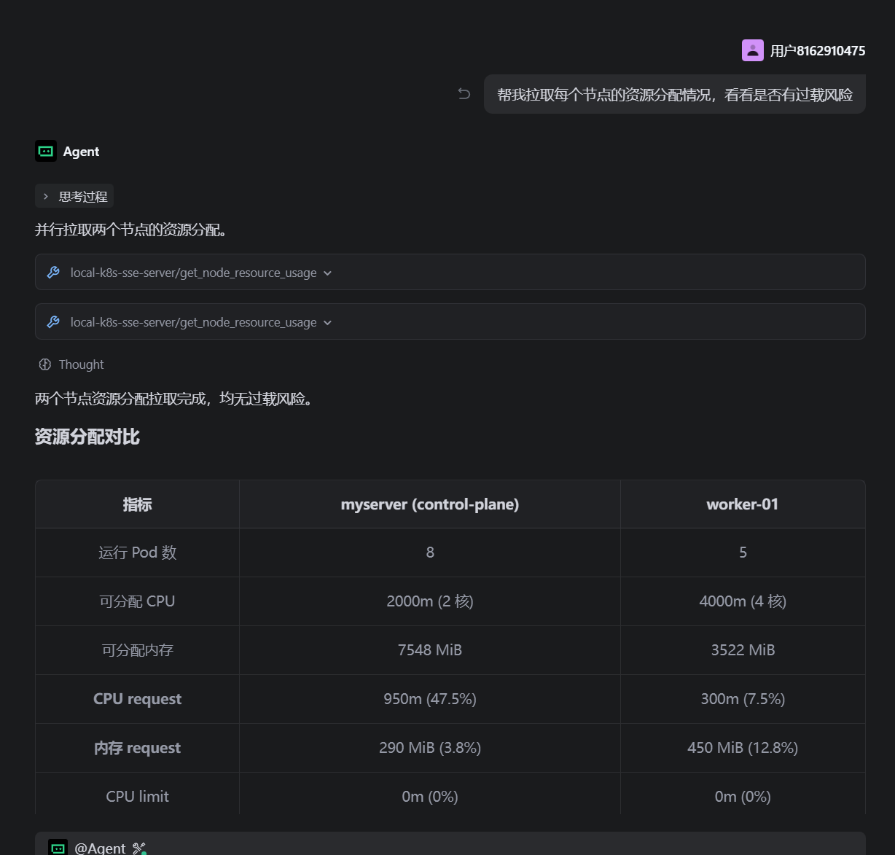
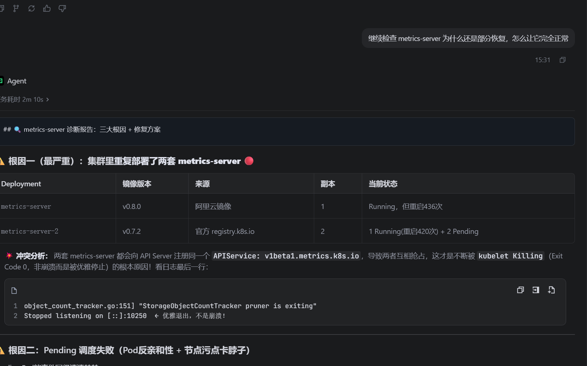
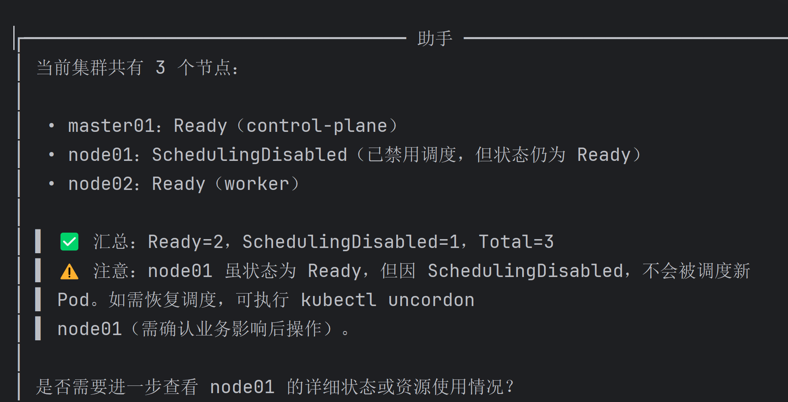
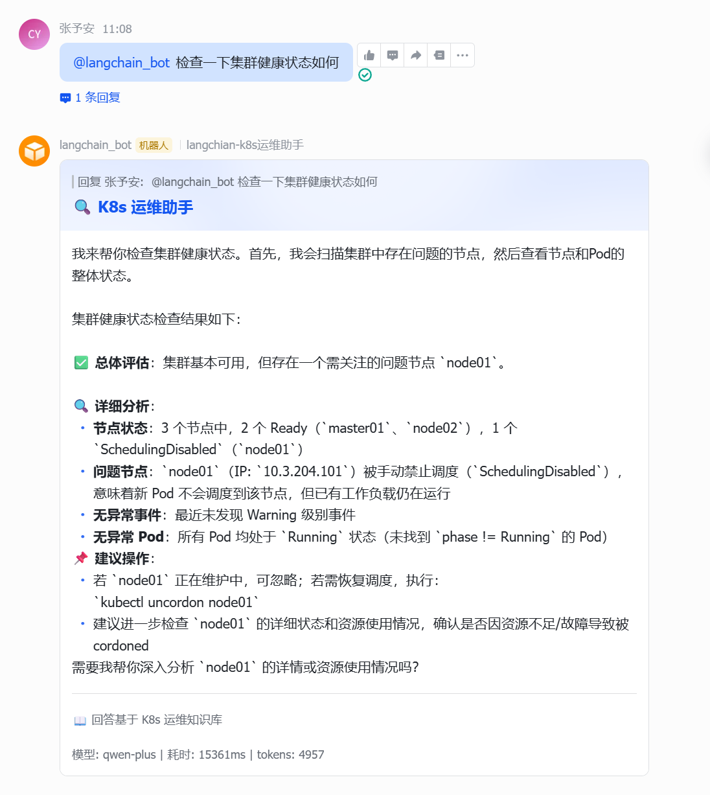
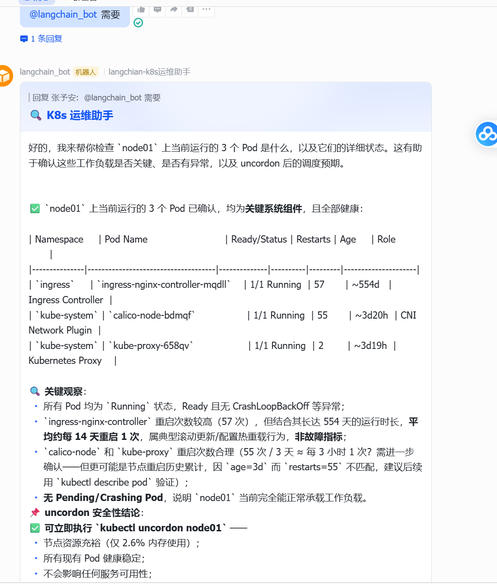
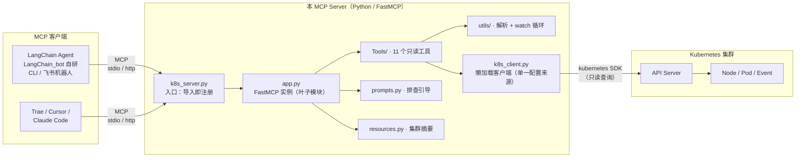

# K8s 集群运维 MCP Server

基于 [FastMCP](https://github.com/jlowin/fastmcp) 的 Kubernetes 运维查询 MCP 服务。把 `kubectl get / describe / logs / events --watch` 等日常排查动作封装成 LLM 可调用的只读工具，让 Claude 等客户端直接读集群状态、快速定位故障。

本项目是底层 MCP 能力层。上层基于 LangChain / LangGraph 的智能运维 Agent（K8s Ops Agent），通过 MCP 协议接入本 Server，用 LLM 编排工具实现「一句话完成集群排障」，支持 CLI 与飞书机器人双端交互，代码在独立仓库 [LangChain_bot](https://github.com/zj-hub-coder/LangChain_bot)。

> 当前版本**只暴露只读工具**（无 create/update/delete）。后续会逐步加入写操作（create / update / delete / exec / scale），届时会同步补齐安全机制（context 白名单、Secret 遮蔽等），见下文「安全说明」。

## 项目演示

底层 MCP Server 采用标准 MCP 协议，可被任意 MCP 客户端复用。下面按「第三方 IDE → 自研 Agent → 团队协作」的顺序，展示接入后的实际对话效果。

**接入 Trae AI IDE**





**接入自研 LangChain Agent —— CLI 对话**



**接入飞书机器人 —— 团队协作**





## 工具清单

| 工具 | 说明 | 对应 kubectl |
| --- | --- | --- |
| `list_nodes` | 节点列表概览 | `kubectl get nodes -o wide` |
| `get_node_detail` | 节点详情 | `kubectl describe node` |
| `get_node_resource_usage` | 节点资源请求/限制汇总与过载评估 | `describe node` 的 Allocated resources |
| `find_problem_nodes` | 扫描问题节点（NotReady / 各种 Pressure） | — |
| `list_pods` | Pod 列表（支持 namespace / label / field 过滤） | `kubectl get pods -o wide` |
| `get_pod_detail` | Pod 详情（支持 label / workload / 名称前缀定位） | `kubectl describe pod` |
| `read_pod_log` | 读取 Pod 容器日志 | `kubectl logs` |
| `query_events` | 查询集群事件（去重 + 排序） | `kubectl get events` |
| `watch_events` | 实时监听事件流 | `kubectl get events --watch` |
| `watch_nodes` | 实时监听节点状态变化 | `kubectl get nodes --watch` |
| `watch_pods` | 实时监听 Pod 状态变化 | `kubectl get pods --watch` |

另有 `@mcp.prompt`（节点排查 / 集群巡检引导）和 `@mcp.resource`（`k8s://cluster/summary` 集群摘要）两类附加能力。

## 架构图



分层说明：

| 层 | 模块 | 职责 |
| --- | --- | --- |
| 传输层 | `k8s_server.py` | 按 `MCP_TRANSPORT` 启动 stdio 或 http，`import Tools` 即触发全部工具注册 |
| 应用层 | `app.py` / `prompts.py` / `resources.py` | FastMCP 实例 + Prompt 引导 + Resource 资源 |
| 工具层 | `Tools/*.py` | 11 个只读工具，每个一个文件，`@mcp.tool()` 装饰器注册 |
| 解析层 | `utils/*.py` | 纯解析 / 状态快照对比 / 通用 watch 循环，无 K8s 与 MCP 依赖 |
| 连接层 | `k8s_client.py` | K8s 客户端懒加载，连接优先级 in-cluster → 显式 kubeconfig → 标准解析链 |

## 目录结构

```
├── app.py              # FastMCP 实例（叶子模块，破循环导入）
├── k8s_server.py       # 入口：导入 Tools 即自动注册全部工具
├── k8s_client.py       # K8s 客户端懒加载 + 单一配置来源
├── config.py           # 12-Factor 环境变量配置
├── prompts.py          # @mcp.prompt 引导
├── resources.py        # @mcp.resource 资源
├── Tools/              # 每个工具一个文件，导入即注册
├── utils/              # 纯解析/辅助模块（无 K8s/MCP 依赖）
└── tests/              # 单元测试
```

## 安装与运行

```bash
# 1. 创建虚拟环境并安装依赖
python -m venv .venv
# Windows
.venv\Scripts\activate
# Linux / macOS
source .venv/bin/activate

pip install -r requirements.txt

# 2. 运行（HTTP transport，默认 127.0.0.1:8081）
python k8s_server.py
```

### 运行测试

```bash
pip install -r requirements-dev.txt
python -m pytest -q
```

## 配置

全部通过环境变量配置，带默认值（见 `config.py`）：

| 变量 | 默认值 | 说明 |
| --- | --- | --- |
| `KUBECONFIG_PATH` | `""` | 显式指定 kubeconfig 路径；留空走官方解析链（`$KUBECONFIG` → `~/.kube/config`） |
| `K8S_VERIFY_SSL` | `true` | 是否校验 TLS 证书；仅在调试自签且明确风险时置 `false` |
| `MCP_SERVER_NAME` | `k8s-node-server` | MCP 服务名 |
| `MCP_TRANSPORT` | `http` | 传输方式，`http` 或 `stdio` |
| `MCP_HOST` | `127.0.0.1` | 监听地址 |
| `MCP_PORT` | `8081` | 监听端口 |

K8s 连接配置加载优先级：**in-cluster（Pod 内 SA）→ 显式 `KUBECONFIG_PATH` → 官方 kubeconfig 解析链**，只取一份配置，不从多个文件拼装。

### 接入 MCP 客户端

以 Claude Code 为例（HTTP transport 已在 `127.0.0.1:8081` 运行时）：

```json
{
  "mcpServers": {
    "k8s-node-server": {
      "url": "http://127.0.0.1:8081/mcp"
    }
  }
}
```

## 安全说明

- **只读工具**：本项目只暴露只读操作（list / get / describe / logs / events），不提供任何变更操作（create / update / delete）。生产部署建议使用只读 RBAC，仅授予 get / list / watch 权限。
- **默认监听本机**：`MCP_HOST` 默认 `127.0.0.1`，服务仅对本机可访问。HTTP transport 不提供认证与限流，如需对外暴露，应在反向代理层增加 TLS 与 Token / OIDC 认证。
- **TLS 证书校验**：默认开启（`K8S_VERIFY_SSL=true`）。`false` 仅用于调试自签证书，生产环境保持开启。
- **凭据不入库**：kubeconfig 文件包含集群凭据，已通过 `.gitignore` 中的 `kubeconfig`、`kubeconfig.*` 规则排除在版本控制之外。

## 已知边界

- 所有工具为**只读**，不含变更操作（这是刻意设计）。
- `watch_*` 系列受全局并发锁限制：同一时刻只允许一个 watch 运行，避免给 API Server 加压。
- 事件/日志输出有长度上限，超大内容会被截断（见 `read_pod_log` 的截断逻辑与 `query_events` 的 `max_count`）。
