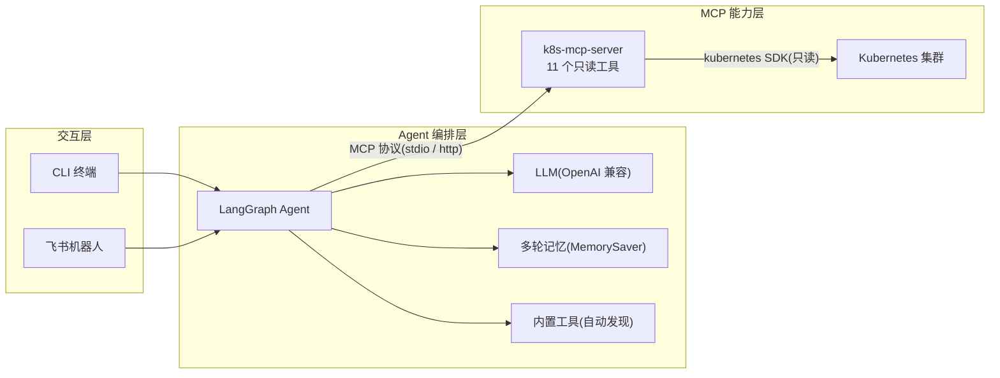

# K8s Ops Agent —— Kubernetes 智能运维助手

> 用自然语言「一句话」完成 Kubernetes 集群的查询、诊断与排障。

---

## 1. 项目简介

**K8s Ops Agent** 是一个面向 SRE 与 Kubernetes 运维团队的智能运维助手。它把日常最繁琐的集群排障动作,封装成一句话就能完成的自然语言对话:

- 你不需要再记住 `kubectl get pods`、`kubectl describe node`、`kubectl logs`、`kubectl get events --watch` 这类命令的参数和组合;
- 你只需要问「**集群里有哪些异常节点?**」「**这个 Pod 为什么一直 CrashLoopBackOff?**」,助手会自动调用底层工具查询、分析,并直接给出结论。

项目由两个相互配合的部分组成:

| 组件 | 角色 | 仓库 |
| --- | --- | --- |
| **k8s-mcp-server** | 底层能力层 —— 把 11 类 kubectl 查询操作封装成标准 MCP 工具 | [k8s-mcp-server](https://github.com/zj-hub-coder/k8s-mcp-server) |
| **LangChain_bot** | 上层智能层 —— LangGraph Agent 编排 LLM 与工具,提供 CLI 与飞书机器人双端交互 | [LangChain_bot](https://github.com/zj-hub-coder/LangChain_bot) |

---

## 2. 解决了什么问题

传统 Kubernetes 排障有三道坎:

1. **命令复杂、难以记忆** —— 查询、描述、看日志、盯事件,每类操作一套命令与参数,组合起来门槛高。
2. **信息分散、结论靠人拼** —— 查一个 Pod 异常,要分别看状态、日志、事件,再自己拼出结论,慢且容易漏。
3. **依赖经验** —— 新手不知道「该从哪查起」,老手也要在多个终端窗口之间来回切换。

**K8s Ops Agent 的解法:**

- **自然语言交互,零学习成本** —— 直接用中文提问,不需要记忆任何命令。
- **一次对话自动串联多步查询** —— 一个「查故障」的问题,Agent 会并行调用多个工具(状态 + 日志 + 事件),再汇总成结论。
- **数据可溯源** —— 每条结论都标明来源工具与对象,不是凭空编造。

---

## 3. 系统架构



架构分三层:

| 层 | 职责 | 关键实现 |
| --- | --- | --- |
| **交互层** | 接收用户输入、渲染回答 | CLI(rich 终端)/ 飞书 WebSocket 长连接机器人(流式卡片) |
| **Agent 编排层** | 理解意图、编排工具、维护上下文 | LangGraph `create_agent` + `MemorySaver` Checkpointer + token 级流式输出 |
| **MCP 能力层** | 把集群查询封装为标准工具 | FastMCP,11 个只读工具,支持 stdio / Streamable HTTP 接入 |

---

## 4. 完整演示流程

下面按「从底层调试到上层使用」的顺序演示整套系统。同一套底层 MCP 工具,可被官方调试器、第三方 AI IDE、自研 Agent 分别接入,体现 MCP「一次封装、多处复用」的价值。

### 4.1 调试底层 MCP 工具 —— MCP Inspector

用官方 MCP Inspector 检查 k8s-mcp-server 暴露的工具。这里以 `watch_nodes` 为例,查看工具的参数 schema 与调用结果,验证底层能力层工作正常。


### 4.2 接入 Trae AI IDE —— 对话查询

底层 MCP Server 采用标准 MCP 协议,接入 Trae 后,即可在 Trae 内置的 AI 助手中用自然语言查询集群状态。


### 4.3 接入自研 LangChain Agent —— CLI 对话

除第三方 IDE 外,底层 MCP Server 也接入了自研的 LangGraph Agent。启动 `cli.py` 后进入多轮对话,直接用自然语言查询集群、排查故障。


### 4.4 接入飞书机器人 —— 团队协作

启动飞书机器人后,在群里 @机器人 提问,机器人以「流式卡片」实时更新回答。


---

## 5. 技术亮点

- **基于 MCP 标准协议** —— 工具「即插即用」,在 `mcp_servers.json` 里加一项即可接入新的 MCP Server,零代码改动。
- **LangGraph Agent 编排** —— 用 `create_agent` 组装 LLM + 工具集 + 系统提示词,`MemorySaver` Checkpointer 按 `thread_id` 维护多轮上下文,支持 token 级流式输出。
- **只读安全设计** —— 底层只暴露查询类操作(get / describe / logs / events),不含任何变更操作,从设计上规避误删、误改集群的风险。
- **双端交互** —— 同一套 Agent 同时服务 CLI 与飞书机器人,覆盖个人排障与团队协作两种场景。
- **配置驱动 + 自动发现** —— MCP Server 走配置驱动,内置工具走目录自动发现(`@tool` 装饰即注册),扩展无需改动核心代码。

---

## 6. 快速开始

> 完整安装步骤见各仓库 README,这里只列出主线。

```powershell
# 1. 启动底层 MCP Server(k8s-mcp-server 仓库)
python k8s_server.py

# 2. 启动上层 Agent(LangChain_bot 仓库)
python -m venv .venv
.venv\Scripts\pip install -e .

# 配置 .env(LLM 与 MCP 配置),然后:
.venv\Scripts\python.exe cli.py              # CLI 对话
.venv\Scripts\python.exe start_lark.py       # 飞书机器人
```

---

## 7. 附录:截图清单

演示截图统一放在 `docs/images/` 目录下。文件名带数字前缀,按演示流程顺序排列:

| 文件名 | 截图内容 |
| --- | --- |
| `01-inspector-watch-nodes.png` | MCP Inspector 调试 `watch_nodes` 工具 |
| `02-trae-chat-1.png` | Trae 对话查询集群(第 1 张) |
| `03-trae-chat-2.png` | Trae 对话查询集群(第 2 张) |
| `04-langchain-cli.png` | 自研 LangChain Agent 的 CLI 对话 |
| `05-lark-chat-1.png` | 飞书机器人对话(第 1 张) |
| `06-lark-chat-2.png` | 飞书机器人对话(第 2 张) |
